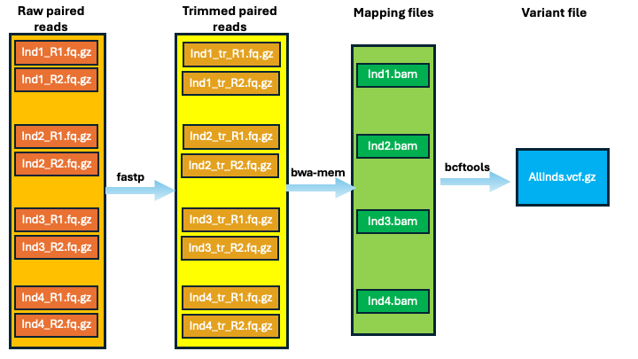

# `OikosMap`
A [NextFlow](https://www.nextflow.io/docs/latest/index.html)-enabled pipeline intended to trim, map and variant-call short read (Illumina or Illumina-like) data to a reference genome, and then call variants.
Takes a directory of paired read files as input, and outputs one `.bam` file per individual, as well as one merged `.vcf`.

## Quickstart

The pipeline can be run with the following command:

```
nextflow run OikosMap.nf --indlist <names_of_inds.txt> --indir </path/to/directory/with/reads/> --refseq <refseq.fa> --prefix <output_prefix>
```

- `--indlist` is a text file containing the names of each individual to be mapped.
  - Mandatory
- `--indir` is the path to a directory of containing the shortreads to be mapped.
  - Mandatory
- `--refseq` is a `fasta` file you intend to map to
  - Mandatory
- `--prefix` is the name of the output files.
  - Optional; defaults to `out`

## Options

All native options in `NextFlow` are usable in `OikosMap` - their documentation can be found [here](https://www.nextflow.io/docs/latest/cli.html).
`--trace` and `--report` are useful for providing usage stats, and the author recommends enabling them.
The following table documents all options specific to `OikosMap`:

| Option | Default | Data type | Description |
| -- | -- | -- | -- |
| `--help`  | `FALSE` | Flag | Set to print a help message and exit. |
| `--indlist` | `null` | String | A text file containing the prefix of every paired read file, where each name is on a newline. See [testing](#testing) for an example. **Mandatory**. |
| `--indir` | `null` | String | The path to the read files you intend to map. Names *must* agree with those in `--indlist`, and files *must* be properly paired. **Mandatory**. |
| `--refseq` | `null` | String | The fasta file you intend to map to. If unindexed, it will be indexed in-place with `samtools faidx`. **Mandatory**. |
| `--threads` | `nproc/2` | Int | The number of threads available to the program. Defaults to $\frac{1}{2}$ the number on the host machine. |
| `--prefix` | `out` | String | The name of the output directory and vcf file. |


## High-level Description

`OikosMap` initially checks that all files in `--indlist` are present in `--indir`, throwing an error if they are not.
Assuming inputs are fine, it then trims files with `fastp` (v.1.0.1, [Chen et al. 2018](https://academic.oup.com/bioinformatics/article/34/17/i884/5093234)) on default settings.

If the refseq is not indexed, we use `samtools faidx`(v.1.18, [Daneck et al. 2021](https://academic.oup.com/gigascience/article/10/2/giab008/6137722)) to do so.
Trimmed files are then mapped to the provided indexed `--refseq` with `bwa mem` (v.0.7.17-r1188, [Li 2013](https://arxiv.org/abs/1303.3997)), and the output bamfiles are then post-processed with `samtools`.

Once mapping finishes, all `bam` files are fed into `bcftools mpileup/call` (v.1.15.1, [Daneck et al. 2021](https://academic.oup.com/gigascience/article/10/2/giab008/6137722)) to produce a vcf.

Results are then written to a final output directory (`${prefix}_results/`) for the end-user to consume.

### Outputs

Important outputs are:
| Description | Path |
| -- | -- |
| Mapping files | `${prefix}_results/mapping/${ind}.bam` |
| Raw vcf | `${prefix}_results/variants/${prefix}.vcf.gz` |


### Flowchart




## Known limitations

## Installation and requirements

### Installation

The pipeline includes two dependencies: [NextFlow](https://www.nextflow.io/docs/latest/getstarted.html), and [Conda](https://conda.io/projects/conda/en/latest/user-guide/install/index.html).
You will need to install all both of these for the pipeline to run.
[Docker](https://docs.docker.com/engine/install/) and [Singularity](https://docs.sylabs.io/guides/3.5/user-guide/introduction.html) are not currently supported.

### Testing

The author provides a set of testing commands to verify correct installation on new machines.
The author further **strongly** recommends running them to 'dry-run' the pipeline before attempting time-consuming analysis.

A successful run **does not** imply biological correctness; it just means all your software dependencies are working.
It does three things:
1. Programmatically create fake files
    - User now knows what real files should look like
2. Dry-runs the entire program with the fakes
    - Assumes that `nextflow` and `conda` are installed and reachable from your `$PATH`.
3. Clean up after itself
    - Removes all `dummy_*` elements

#### 1. Creating dummy input files

```
# Create dummy input files

mkdir dummy_readfiles
touch dummy_readfiles/ind1_R{1,2}.fq.gz
touch dummy_readfiles/ind2_R{1,2}.fq.gz
touch dummy_readfiles/ind3_R{1,2}.fq.gz

# create dummy refseq
mkdir dummy_refseq
touch dummy_refseq/refseq.fa

# Generate new --indlist
echo -e "ind1\nind2\nind3" > dummy_indlist.txt
```

#### 2. Dry-run `OikosMap`

```
nextflow -stub-run OikosMap.nf --indlist dummy_indlist.txt --indir dummy_readfiles --refseq dummy_refseq/refseq.fa --prefix dummy_out
```

#### 3. Cleanup
```
rm -r dummy*
echo "Stub ran successfully."
```

### Requirements

The `OikosMap` pipeline requires a minimum of 16GB RAM and 4 threads for WGS work, but benefits immensely from multithreading.
It does not require GPU support.

## Runtime

Overall runtime scales roughly linearly with input data volume.
